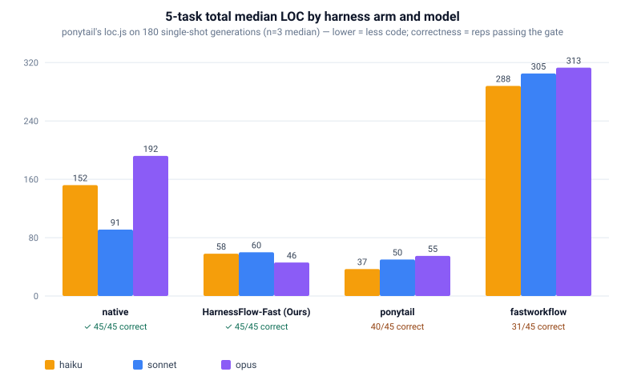

<div align="center">


# HarnessFlow

**Portable AI-coding workflow pack for Claude Code, Codex CLI, and VS Code + Copilot.**

HarnessFlow is a drop-in set of workflow and agent-instruction files: copy it into any repository and your AI coding assistant stops one-shotting changes. It is designed for Claude Code, Codex CLI, and VS Code with GitHub Copilot — tools that can read instructions straight from the repository they're working in. Instead of taking your prompt straight to a diff, this pack gives your assistant a real pipeline: a request template that names the workflow you want, parallel analysis agents that investigate before any code is touched, and a self-challenge pass that pressure-tests the plan before a single line changes. Once the work is done, a QA pass validates the result and what your assistant learned gets written to persistent repo memory. Every change gets the right process, a second opinion before it ships, and a paper trail once it lands and the next request starts a little smarter than the last.

[What it does](#what-it-does) · [Benchmarks](#benchmarks-fast-vs-general) · [Install](#install) · [Get started](#get-started) · [Platforms](#platforms) · [Architecture](#architecture)

</div>

## What It Does

HarnessFlow is a portable **Markdown instruction pack** — there is no runtime, no `npm install`, and no build step. It is designed for Claude Code CLI, Codex CLI, GitHub Copilot in VS Code, Aider, and other AI coding assistants that benefit from structured operating instructions. Instead of letting your assistant one-shot changes from a single prompt, this pack gives every templated request a disciplined, multi-agent workflow with real planning, self-review, QA, and persistent memory:

- **Runs on request** — a filled-in template from `request_template/` names one of 9 request types and loads that workflow file; nothing fires on a bare prompt.
- **Analyzes in parallel** — Focus, Broad, and Free analyst subagents read the codebase from different angles, then a Senior Engineer synthesizes one plan.
- **Challenges itself** — a Devil's Advocate pass stress-tests the plan for regressions and bad assumptions before any code is written.
- **Validates** — a QA Engineer checks the implementation; an opt-in approval gate lets you sign off on the plan first.
- **Remembers** — results are written to `repo_info/` so later requests start with real context instead of re-deriving it.
- **Three modes** — every workflow ships in a `general` (thorough), a `fast` (token-efficient), and a `skill` (community-skill-backed) variant.

Use HarnessFlow for code implementation, refactors, debugging, codebase Q&A, correctness checks, goal-directed execution, stacked-PR creation, repo initialization (first-time or re-initialization), and recurring loops — nine request types, each backed by its own workflow file and available in `general`, `fast`, and `skill` modes. The rest of this README is a high-signal landing page: see what it does, install the entry point for your tool, pick a workflow mode, and dive into the deeper docs and benchmarks only when you need them.


## How it performs

On [ponytail](https://github.com/DietrichGebert/ponytail)'s own 5-task code-generation benchmark — scored with ponytail's own `loc.js` + `correctness.js` — we ran **HarnessFlow-Fast (ours)** against the bare model (`native`), the `ponytail` minimal-code skill, and the `fastworkflow` framework, across three models (180 independent single-shot generations, n=3 median).

<div align="center">

</div>

| arm | Haiku | Sonnet | Opus | always-correct? |
|---|--:|--:|--:|:--:|
| native (no harness) | 152 | 91 | 192 | 45/45 ✅ |
| ponytail | **37** | **50** | 55 | 40/45 |
| HarnessFlow-Fast (ours) | 58 | 60 | **46** | 45/45 ✅ |
| fastworkflow | 288 | 305 | 313 | 31/45 |

*5-task total median lines of code (lower = less code; **bold** = fewest LOC for that model).* **HarnessFlow-Fast (ours) is the only harness arm that is both lean — 34–76% less code than the bare model, and leanest of all arms on Opus — while staying 100% correct on every run.** ponytail is a touch leaner on Haiku and Sonnet but slips to 40/45 (occasionally shipping broken code) and is larger on Opus, while `fastworkflow`'s validation-first style writes 1.6–3.4× *more* code than the baseline and is the least correct (31/45). The model is held constant per arm so the comparison isolates the *harness*. Full methodology and honest caveats live in `experiment_ponytail/REPORT.md`.


### Works with your AI assistant

Every supported platform is a first-class citizen — pick the one you already use:

| Platform | Entry point (generated during setup) |
|---|---|
| Claude Code CLI | root `CLAUDE.md` |
| Codex CLI / Codex in VS Code | root `AGENTS.md` |
| VS Code + GitHub Copilot | `.github/copilot-instructions.md` |
| Aider / other LLMs | follow any workflow file manually (no subagent orchestration) |

### What you can ask for

| Category | What it handles |
|---|---|
| **Code** | Implement, add, or build new functionality |
| **Refactor** | Restructure, reduce redundancy, improve architecture |
| **Debug** | Diagnose and fix errors, crashes, and failing tests |
| **Query** | Explain, document, or answer questions about the codebase |
| **Correctness Check** | Test, verify, validate, or audit existing behavior |
| **Exec** | Execute actions toward a goal (commands, skills, scripts, tools) and validate the outcome |
| **PR** | Break a large branch into reviewable, stacked PRs |
| **Initialize** | Bootstrap repo memory for first-time setup, or re-initialize: validate the existing memory against the code and diff-update it |
| **Loop** | Repeat a task or check iteratively until a condition is met |

Each category is backed by workflow files under `workflow/` — shared `general`, `fast`, and `skill` sets, each platform-adaptive and used by all platforms — with a matching fill-in prompt in `request_template/`.


## Benchmarks: fast vs general

The `fast` workflow is the efficiency–quality sweet spot. Across two independent benchmarks — a 1,000-line greenfield OpenCV + scikit-learn build, and a real [SWE-bench](https://www.swebench.com/) bug fix (`sympy__sympy-24213`) — it reaches the **same successful outcome as the heavyweight `general` workflow while spending 39–50% of the tokens**, and ships the leanest, fully-documented code of any approach tested.

| Metric | baseline | **fast** | general |
|---|---|---|---|
| Code lines (AST) | 1,225 | **860 ⬅ leanest** | 1,173 |
| Docstring coverage | 96.3% | **100%** | 100% |
| Largest function | 151 | **146 ⬅ best** | 151 |
| SWE: matches gold/canonical fix | ❌ | **✅** | ✅ |
| Self-verified before shipping | ❌ none | **✅ 32 tests green** | ✅ tests + edge probes |
| Contract tests | 7/10 | **10/10** | 10/10 |

| Dimension | baseline (no harness) | **fast** | general |
|---|---|---|---|
| Token cost vs `general` | cheapest, but no assurance | **2.0–2.6× cheaper, same result** | most expensive (baseline) |
| Outcome | resolved / 100% accuracy | **resolved / 100% accuracy** | resolved / 100% accuracy |
| Code footprint (ShapeLab) | 1,225 lines, 96% docs | **860 lines (leanest), 100% docs** | 1,173 lines, 100% docs |
| SWE-bench fix | non-canonical, unverified | **exact canonical fix, verified** | exact canonical fix, verified |

The model is held constant (Claude Sonnet 4.6 subagents, Opus 4.8 orchestrator) so the comparison isolates the *harness*, not the model. Full methodology, per-role token breakdowns, and caveats live in the benchmark run logs `experiment/results/COMPARISON_LOG.md` and `experiment_swe/results/SWE_COMPARISON_LOG.md`.

> The raw benchmark runs under `experiment/`, `experiment_swe/`, and `experiment_ponytail/` (including `experiment_ponytail/REPORT.md` referenced above) are git-ignored, so a fresh clone of this repo does not include them.

## Install

> **Prerequisites:** `git` and `bash`. For the CLI platforms, install the `claude` and/or `codex` CLI first.

### 1. Get the pack into your repo

```bash
# Clone HarnessFlow wherever you like to keep tools
git clone https://github.com/HangYu8123/HarnessFlow.git

# From your target repo, copy the pack into .github/HarnessFlow/
cd /path/to/your-repo
mkdir -p .github/HarnessFlow
rsync -a --exclude .git --exclude .DS_Store --exclude .github \
  --exclude repo_info --exclude experiment --exclude experiment_swe \
  --exclude experiment_ponytail \
  /path/to/HarnessFlow/ .github/HarnessFlow/
```

Replace `/path/to/HarnessFlow/` with wherever you cloned it. The excludes keep the source repo's own local-only files out of your repo — its `repo_info/` memory (which is *about HarnessFlow itself*), the `experiment*/` benchmark runs, `.DS_Store`, and `.git`; `cli_setup.sh` then recreates empty `repo_info/` files for *your* codebase. No `rsync`? Use `cp -r /path/to/HarnessFlow/. .github/HarnessFlow/`, then delete the copied `.github/HarnessFlow/.git`, `repo_info/`, `experiment/`, `experiment_swe/`, `experiment_ponytail/`, and any `.DS_Store` files. The pack must end up at **`.github/HarnessFlow/`** — both setup scripts validate this path.

### 2. Run the setup script for your platform

```bash
# Claude Code CLI / Codex CLI / Codex in VS Code
bash .github/HarnessFlow/cli_setup.sh

# VS Code + GitHub Copilot
bash .github/HarnessFlow/setup.sh
```

`cli_setup.sh` generates the root `CLAUDE.md` / `AGENTS.md` routers and ensures the `repo_info/` memory files exist. `setup.sh` writes `.vscode/settings.json` and `.github/copilot-instructions.md`. Existing custom files are never overwritten.

## Get Started

Only a filled-in request template starts a workflow. Plain prompts and quoted logs do not, and the assistant never reconstructs a template.

### Step 1 — Initialize repo memory

This populates `repo_info/` with an overview of your codebase that every later request reuses. Re-running it on an already-initialized repo re-initializes instead of starting over: existing overviews are validated against the current code and diff-updated (see `_lib/reinitialize.md`).

Copy `request_template/initialize_request_template.md`, fill it in, and paste it into Claude Code CLI, Codex CLI, or the Copilot Chat panel.

### Step 2 — Send a request template

Pick the template for what you want — `code_request_template.md`, `debug_request_template.md`, `pr_request_template.md`, and so on — fill in your task, and paste the whole file in. Each template already carries the workflow category, the `mode:`, and the exact instruction file for your tool.

The `mode:` header picks the workflow family — `fast` for the token-efficient path, `general` for the thorough one, `skill` for the community-skill-backed variant. Templates ship with `mode: fast` prefilled.

## Platforms

| Environment | Auto-discovered router (shared rules) | How a workflow starts |
|---|---|---|
| Claude Code CLI | root `CLAUDE.md` | a filled-in `request_template/` prompt |
| Codex CLI / Codex in VS Code | root `AGENTS.md` | a filled-in `request_template/` prompt |
| VS Code + Copilot | `.github/copilot-instructions.md` | a filled-in `request_template/` prompt |
| Aider / generic LLMs | — | manual file references |

The template's `mode:` header picks the family: `general` → `workflow/general_workflow/`, `fast` → `workflow/token_effective_workflow/`, `skill` → `workflow/skill_workflow/`.

## Architecture

The source repo stores the pack at the repo root. The installed layout expected by the scripts and CLI entry points is:

```text
<target-repo>/
|-- .github/
|   |-- copilot-instructions.md
|   `-- HarnessFlow/
|       |-- AGENTS.md
|       |-- CLAUDE.md
|       |-- copilot-instructions.md
|       |-- setup.sh
|       |-- cli_setup.sh
|       |-- sync_agent_definitions.py
|       |-- _lib/
|       |-- philosophy/
|       |-- workflow/
|       |-- agents/
|       |-- request_template/
|       |-- skills/
|       `-- repo_info/
|-- AGENTS.md
|-- CLAUDE.md
|-- .claude/
|   |-- rules/
|   `-- agents/
`-- .codex/
    `-- agents/
```

`AGENTS.md` and `CLAUDE.md` at the target repo root are generated by `cli_setup.sh`. `.github/copilot-instructions.md` is generated by `setup.sh` or `cli_setup.sh`. `.claude/agents/*.md` and `.codex/agents/*.toml` are the native worker definitions generated from `agents/*.agent.md` by `sync_agent_definitions.py` and installed by `cli_setup.sh`.

## What Is In This Repo

| Path | Purpose |
|---|---|
| `copilot-instructions.md` | VS Code Copilot router template. |
| `CLAUDE.md` | Claude Code CLI router template copied to the target repo root by `cli_setup.sh`. |
| `AGENTS.md` | Codex CLI router template copied to the target repo root by `cli_setup.sh`. |
| `_lib/` | Shared procedures: the workflow contract (main agent) and its short subagent-facing subset `subagent_contract.md`, safety rules, approval-gate and re-initialization rules, loop-governance and stay-active rules, local-skill discovery, pack-path resolution, the `simplify` / `code_review` review-skill resolution, and the subagent-effectiveness record. |
| `philosophy/` | Shared behavioral guidance used by workflows and subagents. |
| `workflow/` | The three shared, platform-adaptive workflow families (`general` / `fast` / `skill`), each used by all supported tools. |
| `agents/` | Source worker-agent definitions plus `agents/INDEX.md`. |
| `.claude/agents/` · `.codex/agents/` | Native worker definitions generated from `agents/*.agent.md`, copied to target repos by `cli_setup.sh`. Do not hand-edit. |
| `sync_agent_definitions.py` | Regenerates both native definition sets from `agents/*.agent.md`. |
| `request_template/` | Fill-in request templates, including `mode: general` and `mode: fast` selection. |
| `skills/` | Vendored skill definitions plus `skill_workflow_skills.md`, the community-skill registry that powers `mode: skill`. |
| `.claude/rules/` | Claude Code path-scoped rules copied to target repos by `cli_setup.sh`. |
| `setup.sh` | Configures VS Code workspace settings and generated Copilot instructions in a target repo. |
| `cli_setup.sh` | Generates CLI entry points and ensures target `repo_info/` files exist. |
| `repo_info/` | Local/generated repo memory files. This directory is ignored by git in this source repo. |

## Workflow Families

Each workflow family currently contains these instruction files:

```text
code.instructions.md
correctness_check.instructions.md
debug.instructions.md
exec.instructions.md
initialize.instructions.md
loop.instructions.md
pr.instructions.md
query.instructions.md
refactor.instructions.md
```

The three workflow families are:

| Directory | Mode | Intended use |
|---|---|---|
| `workflow/general_workflow/` | `mode: general` | Shared thorough workflows — one platform-adaptive set used by Claude Code, Codex, and VS Code Copilot. |
| `workflow/token_effective_workflow/` | `mode: fast` | Streamlined token-efficient workflows — one platform-adaptive set shared by all three tools. |
| `workflow/skill_workflow/` | `mode: skill` | Skill-backed variant of the fast family — selected step instructions are replaced by confirmed ≥1000-star community skills (catalogued in `skills/skill_workflow_skills.md`), each with an inline fallback. Shared by all three tools. |

The pack covers nine categories: code implementation, refactor, debug, query, correctness check, exec, PR creation, initialize, and loop. Each maps to a `*.instructions.md` file present in every workflow family, and each is reached through its fill-in prompt in `request_template/`; the root routers hold only the shared rules a workflow needs once its template has named it. Each shared workflow set adapts its behavior to the active agent (subagent mechanism, context passing, and native-skill steps) via `_lib/workflow_contract.md`.

## Setup Scripts

### `setup.sh`

Run from the target repo root after copying the pack to `.github/HarnessFlow/`.

It validates that the pack is present, then writes or updates `.vscode/settings.json` with:

```json
{
  "chat.instructionsFilesLocations": {
    ".github/HarnessFlow": true,
    ".claude/rules": true
  },
  "chat.agentFilesLocations": {
    ".github/HarnessFlow/agents": true
  },
  "chat.includeReferencedInstructions": true
}
```

It also creates or refreshes `.github/copilot-instructions.md` when that file is generated by this pack. Existing custom Copilot instructions are left unchanged.

When merging an existing VS Code settings file, the script tries `python3`, then `node`, then `jq`. If none are available, it prints manual settings to add.

### `cli_setup.sh`

Run from the target repo root after copying the pack to `.github/HarnessFlow/`.

It:

- Detects whether `claude` or `codex` is on `PATH`.
- Creates or refreshes root `CLAUDE.md` and `AGENTS.md` when they are generated by this pack.
- Creates or refreshes `.github/copilot-instructions.md` when appropriate.
- Copies `.claude/rules/*.md` into the target repo.
- Installs the native worker definitions — `.claude/agents/*.md` for Claude Code and `.codex/agents/*.toml` for Codex — so subagents spawn by agent type instead of by inline prompt.
- Ensures the ten canonical `repo_info/` files exist under the installed pack.

Existing custom files are not overwritten unless they contain this pack's generated markers.

## Request Templates

`request_template/` contains user-facing prompt templates:

```text
code_request_template.md
correctness_check_request_template.md
debug_request_template.md
exec_request_template.md
initialize_request_template.md
loop_request_template.md
pr_request_template.md
query_request_template.md
refactor_request_template.md
```

Templates ship with the token-efficient fast mode prefilled:

```text
mode: fast
```

Switch to the full general pipeline with:

```text
mode: general
```

Or select the skill-backed variant with:

```text
mode: skill
```

For VS Code Copilot, `general` selects `workflow/general_workflow/`, `fast` selects `workflow/token_effective_workflow/`, and `skill` selects `workflow/skill_workflow/`.
For Codex CLI or Codex in VS Code, `general` selects `workflow/general_workflow/`, `fast` selects `workflow/token_effective_workflow/`, and `skill` selects `workflow/skill_workflow/`. The templates use `@/.github/HarnessFlow/...` paths for VS Code Copilot and filesystem paths for Codex.

### Template builder (GUI)

If editing the templates by hand is fiddly, use the **Request Builder** — a single self-contained page (no install, no build, no dependencies).

**Open it with one command** — starts a tiny local server and pops the page open in your browser automatically:

```bash
python3 harness_gui.py
```

Or just double-click **`harness_gui.html`** to open it directly. Either way you can:

- pick any of the 9 templates and copy the finished prompt in one click (or download it as `.md`);
- flip parameters with buttons — `mode` (fast/general/skill), `agent type` (claude/codex/copilot), `subagent_model` (default Opus 5), `subagent_effort` (default low; `inherit`/low/medium/high/xhigh/max), `online_researcher_effort` (default medium; same scale, for the Online Researcher alone), the one-row analysis switches `diversifier` / `devils_advocate` / `online_research`, `reproduce` (debug), and the opt-in review skills `simplify` + `code_review` (same line, default off; code/debug/refactor/exec/pr/loop; each `false` / `true` = Claude Code's native `/simplify` · `/code-review` / `local` = the pack's own local review skills, which run on any platform) — which rewrite only the copied text, never the source files;
- fill the template's input fields inline, and see the exact `workflow/...` instructions file the selection resolves to.

The launcher serves over http so the templates stay live-synced from `request_template/`; double-clicking the HTML works fully offline from the bundled snapshots.

## Agents And Skills

`agents/` defines **16 worker agents**, orchestrated by the per-category workflow instruction files under `workflow/<family>/` (which act as the coordinators). Worker agents include Focus Analyst, Broad Analyst, Free Analyst, Senior Engineer, Principal Engineer, Devils Advocate, Diversifier, Online Researcher, Implementer, Executor, QA Engineer, Bug Reproducer, and the refactor specialists Architecture, Redundancy, Robustness, and Complexity Analyst.

Each `agents/<slug>.agent.md` is the single source of truth for its role, projected by `sync_agent_definitions.py` into the two native definition formats — `.claude/agents/<slug>.md` and `.codex/agents/<slug>.toml` — which `cli_setup.sh` installs. Spawning by agent type (`focus-analyst`, `senior-engineer`, …) makes the role text the subagent's **system prompt**, so it costs nothing per spawn instead of being re-sent or read in-band, and it enforces that role's tools (Claude Code) and sandbox (Codex). **Re-run `python3 sync_agent_definitions.py` from the pack root after editing any `agents/*.agent.md`.**

See `agents/INDEX.md` for the complete registry.

`skills/` contains six **local** skills plus a registry of **external community skills**:

- `breakdown-pr`: analyzes a large branch or PR and proposes a stacked PR breakdown.
- `claude-native-skills-subagents`: Claude Code-only post-implementation orchestration for native skills such as `/simplify`, `/code-review`, `/batch`, and `/claude-api`. Runs only for `simplify: true` / `code_review: true`.
- `code-simplification`: the `simplify: local` alternative to Claude Code's native `/simplify` — reduces complexity in the diff while preserving behavior, on any platform. A short self-contained pack skill, distilled from `addyosmani/agent-skills` (MIT).
- `code-review-and-quality`: the `code_review: local` alternative to Claude Code's native `/code-review` — a review-only pass over correctness, readability, architecture, security, and performance, on any platform. A short self-contained pack skill, distilled from `addyosmani/agent-skills` (MIT).
- `weekly-update-report`: summarizes the last 7 days of git commit history into a "what I shipped last week" update report (explicit request only).
- `write-readme`: generates a structured, pipeline-and-component-oriented `README.md` grounded in the repo's actual source and `repo_info/` context.
- `skill_workflow_skills.md`: the registry that powers `mode: skill` — it catalogs the popular community skills (each verified at ≥1000 GitHub stars) that replace selected step instructions in `workflow/skill_workflow/`, with sources, verified star counts, exact paths, and a per-step inline fallback.

### Community skills behind `mode: skill`

The skill-backed workflow swaps selected step instructions for confirmed community skills. Each is referenced by `owner/repo:path` (not vendored into HarnessFlow), and every replaced step keeps an inline fallback so the workflow never blocks if a skill is missing:

| Step it backs | Community skill | Source |
|---|---|---|
| Planning | `writing-plans` (+ optional `brainstorming`) | `obra/superpowers` |
| Implementation | `executing-plans` + `test-driven-development` | `obra/superpowers` |
| Debug reproduction & diagnosis | `systematic-debugging` | `obra/superpowers` |
| Challenge / devil's advocate | `the-fool` | `Jeffallan/claude-skills` |
| Online research report | `deep-research` | `davila7/claude-code-templates` |
| Correctness analysis | `code-reviewer` | `Jeffallan/claude-skills` |

Verified star counts and verification dates live only in `skills/skill_workflow_skills.md` (single source — re-verify there).

A step is replaced **only** when a skill was found with ≥1000 verified stars *and* genuinely fits that step; otherwise the original token-efficient instructions are kept verbatim. See `skills/skill_workflow_skills.md` for the full registry, the alternatives considered, and install/vendor steps.

## Repo Memory

Workflows use `repo_info/` as persistent repo memory. `cli_setup.sh` ensures these canonical files exist in the installed pack:

```text
codebase_overview.md
known_issues.md
known_issues_auto_generated.md
past_Correctness_Check.md
past_Q&A.md
scripts_overview.md
subagent_effectiveness.md
update_logs.md
update_logs_all.md
update_logs_auto_generated.md
```

`subagent_effectiveness.md` is the per-run record of whether each opt-in helper subagent (Devils Advocate, Diversifier, Online Researcher, `simplify`, `code_review`) actually brought useful information — two sentences per helper, appended by every workflow's final step per `_lib/subagent_effectiveness.md`.

In this source repo, `repo_info/` is ignored by git. In a target repo, initialize or refresh it for that specific codebase before relying on later workflows. Re-running the initialize workflow never discards existing repo_info: it validates the existing claims against the current code, applies a targeted diff-update, and revalidates the repo as a whole (`_lib/reinitialize.md`).

Multi-layer repos are supported: when the target repo contains sub-repos — or is itself a sub-repo beside adjacent repos — each carrying its own `repo_info/`, workflows also read those layers' `codebase_overview.md` and `scripts_overview.md` as labeled cross-layer context (see `_lib/workflow_contract.md` §Key Context Files → Multi-Layer / Nested Repos).

## Path Rules

- In this source repo, paths are root-relative, for example `workflow/general_workflow/code.instructions.md`, `workflow/token_effective_workflow/code.instructions.md`, or `workflow/skill_workflow/code.instructions.md`.
- In an installed target repo, the pack lives under `.github/HarnessFlow/`.
- VS Code workflow prompts may use `@/.github/HarnessFlow/...`.
- CLI entry points use filesystem-relative paths such as `.github/HarnessFlow/workflow/general_workflow/code.instructions.md`, `.github/HarnessFlow/workflow/token_effective_workflow/code.instructions.md`, and `.github/HarnessFlow/workflow/skill_workflow/code.instructions.md`.
- Do not add VS Code `@/` prefixes to CLI workflow files.

## Safety Rules

The shared workflow contract and safety rules require:

- Do not try to commit changes to GitHub.
- Do not write spam files into the repo.
- Do not use `sudo`.
- For code, debug, and refactor workflows, print the finalized plan before implementation. If the user requested no code changes, stop after the plan; otherwise continue.

Keep destructive auto-approval disabled for any command that can delete or overwrite user files.

## Limitations

- This repo is an instruction pack, not an application. There is no package manifest, runtime, build command, or formal test suite.
- The setup scripts are Bash scripts.
- CLI subagent behavior depends on the capabilities of the active CLI tool and its support for selecting the specified subagent model.
- Claude-native skill steps only apply in Claude Code environments.
- The source repo ignores `.github/` and `repo_info/`, so generated target-repo files are not tracked here.
- Root `AGENTS.md` and `CLAUDE.md` in this source repo are templates for installed target repos; their `.github/HarnessFlow/...` paths are expected to resolve after installation.
